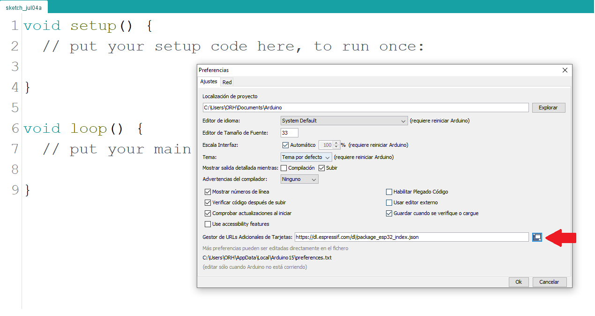
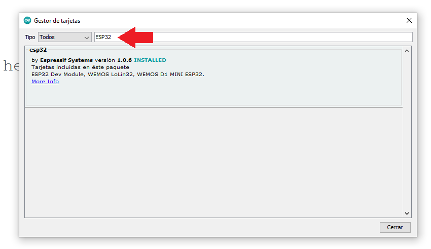
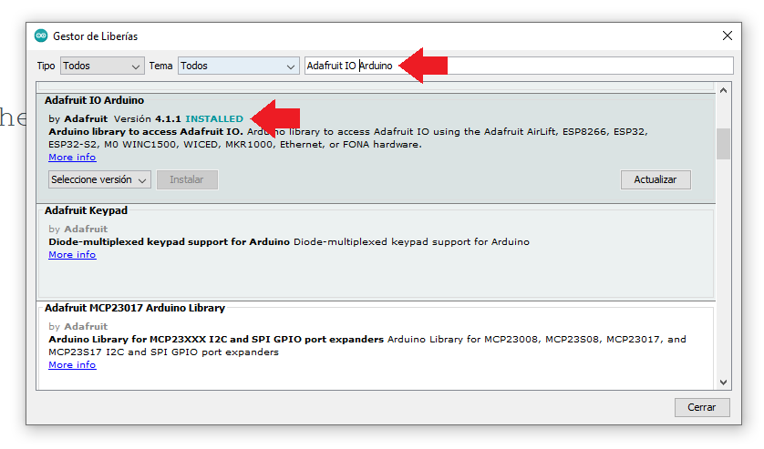
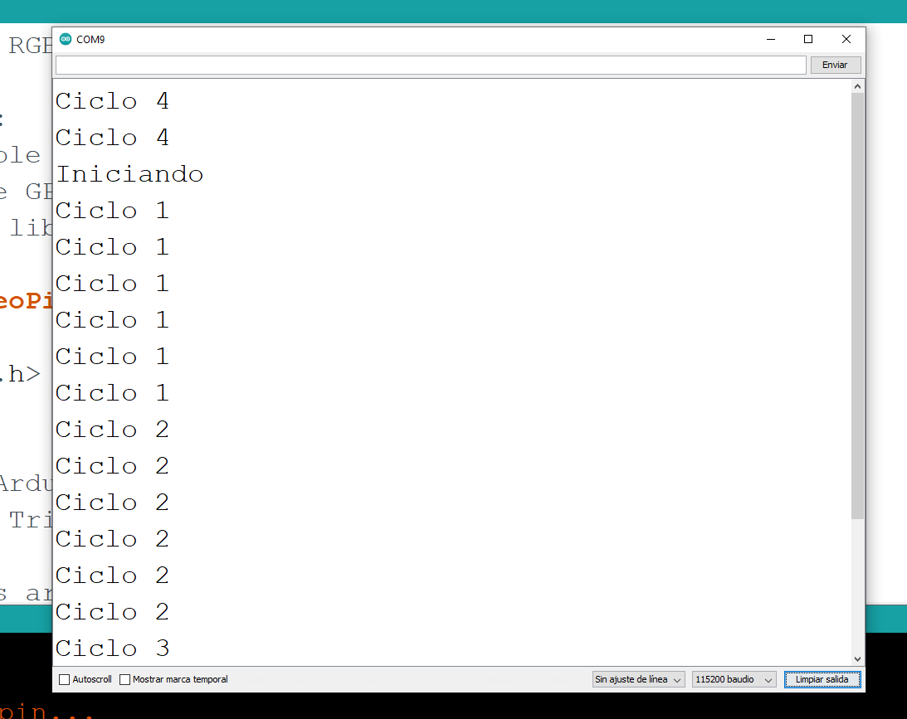
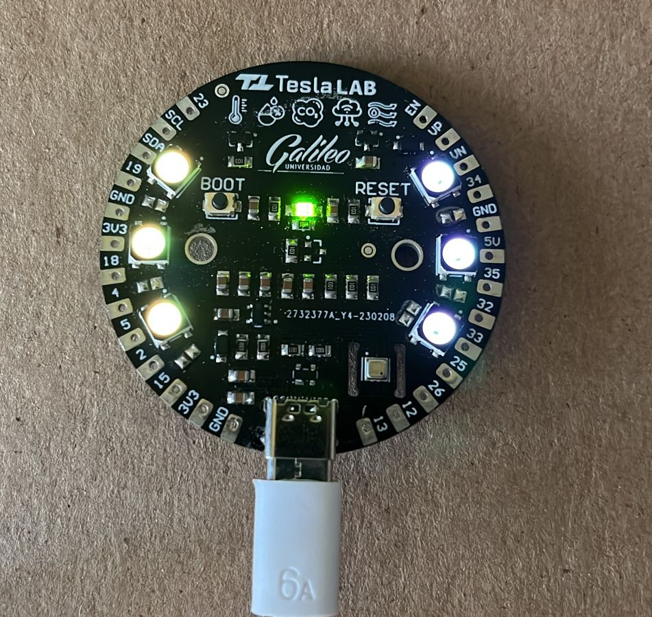
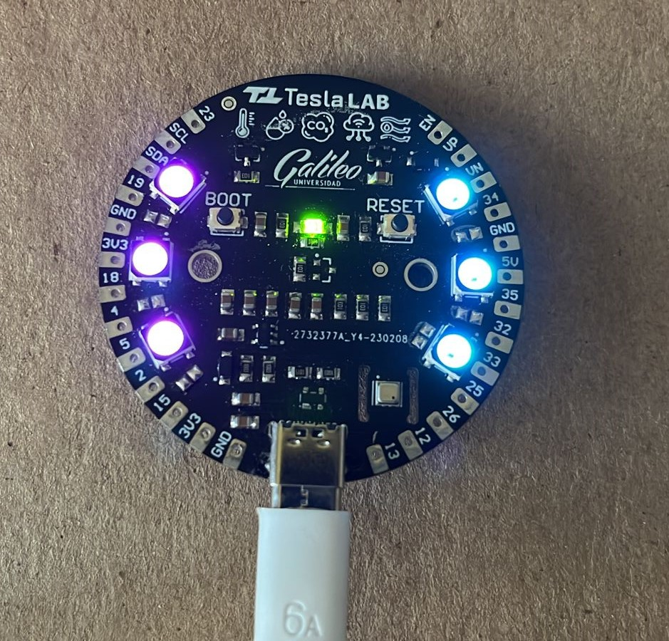
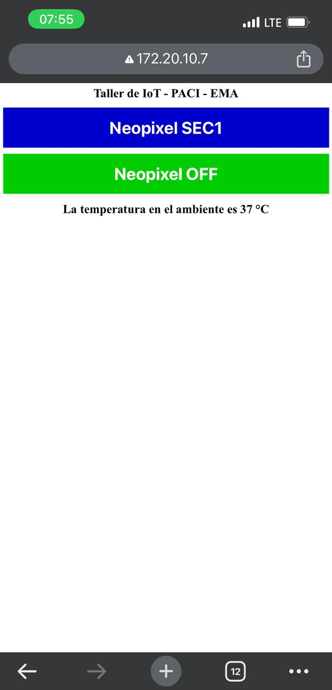

# Mediciones Ambientales con GaLIoT Board
## PACI - Electrónica y Medio Ambiente - 2023

## Instalación de la Tarjeta GALIoT Board

Para la instalación en Arduino IDE debemos seguir los siguientes pasos:

1. Abrir ARDUINO IDE
2. Debemos ir a la pestaña ***Archivo***->***Preferencias***.
	- En la pestaña ***Ajustes*** buscamos la opción: ***Gestor de URLs Adicionales de Tarjetas: ***
	- Pegamos la siguiente URL: `https://dl.espressif.com/dl/package_esp32_index.json`
	- Luego presionamos la opción ***OK*** y automáticamente se cerrará la ventana.

    

3. Debemos ir a la pestaña ***Herramientas***->***Placa***->***Gestor de tarjetas***.
	- Colocamos en la barra de búsqueda ***ESP32***.
	- Seleccionamos la opción que nos muestre ***ESP32*** de Expressif.
	- Instalamos y luego presionamos la opción de ***Cerrar***.

   

4. Debemos ir a la pestaña ***Herramientas***->***Placa***->***ESP32 Arduino***.
   	- Seleccionamos la opción que nos muestre ***ESP32 Dev Module*** o ***ESP32 Wrover Module*** de Expressif.
  
    
 	

Con esto tendremos completa la instalación de nuestra tarjeta ESP32 y lista para ser programada.

## Instalación USB Driver ***(Si no reconoce el puerto COM)***

En algunos casos nuestra PC no es capaz de reconocer el dispositivo USB que nosotros conectamos, es por ello que dejaremos un archivo para la instalación del driver con ello nuestra PC deberá ser capaz de reconocer el dispositivo conectado, en caso de que el problema persista asegúrese de que su dispositivo no se este sobre calentando.

[Descarga este driver para Windows][DRIVER_USB]

[DRIVER_USB]: https://cdn.sparkfun.com/assets/learn_tutorials/5/9/7/Windows-CH340-Driver.zip?_gl=1*wudwzh*_ga*MTE0NjMwNzUzNC4xNjgzNjU2NDcz*_ga_T369JS7J9N*MTY4ODUzNjczNi4xLjEuMTY4ODUzNzA4MC4wLjAuMA..

1. Descomprimir el archivo ZIP descargado 
2. Seleccionar el archivo para instalación de Windows
	- SETUP.exe
3. Seleccionar CH341SER.INF
4. Click en la opción ***Install***
5. Cuando este instalado, debemos cerrar la ventana y listo.

Con esto estaría lista la instalación del Driver USB para nuestra tarjeta en el Sistema Operativo Windows.

Puede seguir está guía para la instalación como una segunda opción:

[Sigue la guía para instalar el driver CH340][DRIVER_CH340]

[DRIVER_CH340]: https://learn.sparkfun.com/tutorials/how-to-install-ch340-drivers/windows-710

## Instalación de librerias en Arduino
1. Adafruit IO Arduino *** de Adafruit ***
   
   
   
3. Adafruit BME680 	*** de Adafruit ***
   
   

## Código Base 

1. El código base de que se le brinda le permite realizar interacción con la tarjeta.
2. Puedes encontrar varios ejemplos en la carpeta de ejemplos de este github.

## Pinout

### NeoPixels
Nombre | GPIO 
--- | --- 
DATA | 14
VDD | 3V3
VSS | GND

### I2C Connector STEMMA

Nombre | GPIO 
--- | --- 
SCL | 22
SDI | 21
VDD | 3V3
VSS | GND

### Buzzer
Nombre | GPIO 
--- | --- 
DATA | 27
VDD | 3V3
VSS | GND

## Ejemplos básicos

### Pruebas con sensor BME680
Utilice el código de ejemplo con nombre ***galiot_board-bme680test*** y podrá tener una interacción con el Sensor BME680 despegando algunas variables ambientales.
   
   

### Pruebas con Neopixeles
Utilice el código de ejemplo con nombre ***galiot_board-neopixel-test-simple-v1*** y logrará una interacción con los 6 neopixeles de la tarjeta.

En el Monitor Serial recibirá retroalimentación cuando el ciclo de encendido de Neopixeles esté iniciando y los ciclos que realiza.
   
   

A continuación logrará ver ejemplos de los ciclos que realiza el programa ejemplo de los Neopixeles.
   
   

   

   

### Instalando un WiFi Server
Utilice el código de ejemplo con nombre ***galiot_board-wifiserver-v2*** y logrará una interacción con un servidor web instalado dentro del ESP32. En esta interacción usted logrará interactuar por medio de botones con los neopixeles de la tarjeta y logrará ver desplegada en la página web la temperatura del sensor BME680.

En el Monitor Serial se verá la retroalimentación cuando esté iniciando el programa y mensajes de conexión al WiFi, prueba del sensor BME680 y la conexión de algún cliente al webserver.
   
   

En la siguiente imagen lográ ver la página web corriendo en el explorador de un teléfono celular.
   
   

